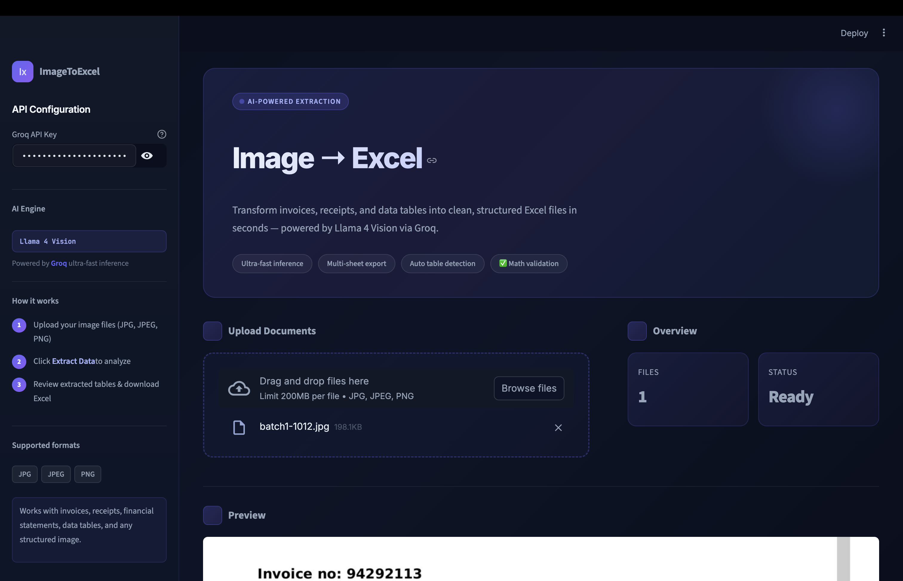
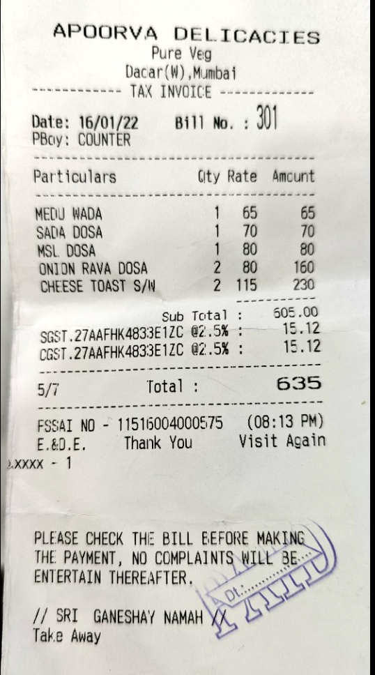
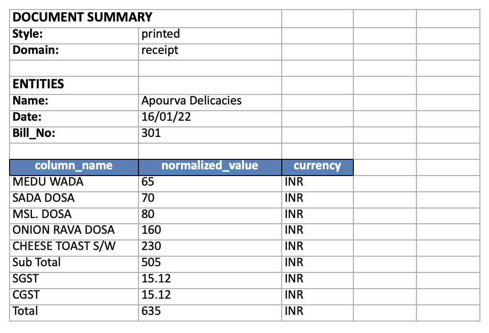
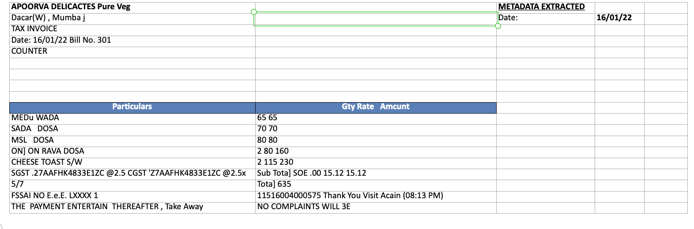
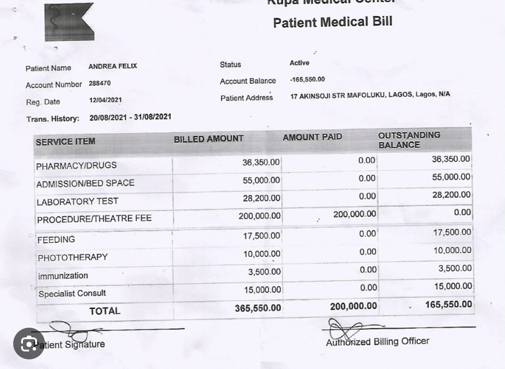
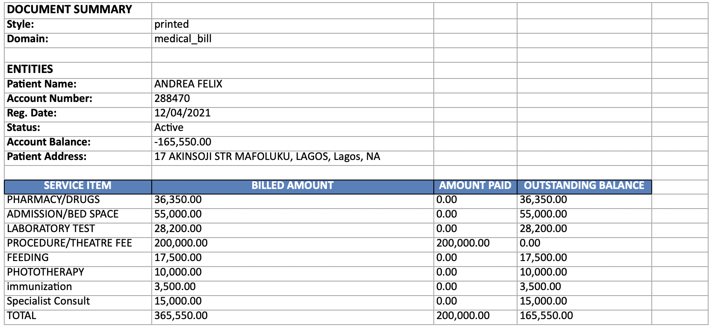
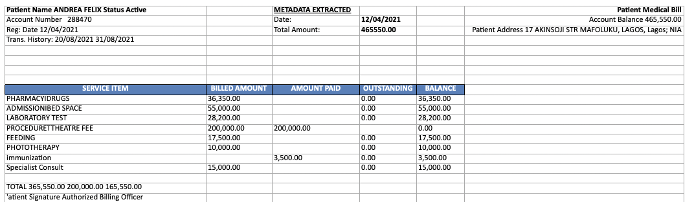

# ImageToExcel

A Python application that extracts structured data from images of invoices, bills, and tables and converts them into clean, multi-sheet Excel files. It uses Llama 4 Vision via the Groq API for fast, accurate extraction and comes with a Streamlit web interface as well as a command-line pipeline for batch processing.

---

## What it does

Point the app at an image of a document — a medical bill, food receipt, financial table, or anything with structured data — and it returns a formatted Excel file with the data organised into rows and columns. The vision model reads the image directly, so there is no OCR pre-processing step required.

For cases where a local OCR fallback is preferred, the CLI pipeline also supports EasyOCR with a spatial layout algorithm that reconstructs table structure from raw bounding box positions.

---

## Interface



---

## Output comparison

The table below shows a medical bill image and how each extraction method interprets it into Excel.

| Source Image | Vision AI Output | OCR Fallback Output |
|:---:|:---:|:---:|
|  |  |  |

| Source Image | Vision AI Output | OCR Fallback Output |
|:---:|:---:|:---:|
|  |  |  |

The Vision AI path produces cleaner column names and handles merged cells and multi-line values significantly better than the spatial OCR approach.

---

## Project structure

```
ImageToExcel/
├── core/
│   ├── constants.py          # Paths, model name, shared config
│   ├── excel_builder.py      # Builds .xlsx from extracted JSON
│   ├── exceptions.py         # Custom exception types
│   ├── groq_client.py        # Thin wrapper around the Groq SDK
│   ├── image_preprocessor.py # Resize and encode images for the API
│   └── prompts.py            # System and user prompts for the LLM
├── extractors/
│   ├── base.py               # Abstract base class for extractors
│   ├── vision_extractor.py   # Groq Llama 4 Vision extractor
│   ├── ocr_extractor.py      # EasyOCR-based extractor
│   └── spatial_table.py      # Spatial layout reconstruction
├── tests/                    # pytest test suite
├── assets/                   # Screenshots and sample outputs
├── input/                    # Drop source images here for CLI pipeline
├── streamlit_app.py          # Web interface
├── run_pipeline.py           # CLI entry point
├── requirements.txt
└── pyproject.toml
```

---

## Setup

**Prerequisites:** Python 3.10 or later, a [Groq API key](https://console.groq.com).

```bash
# Clone the repository
git clone https://github.com/Uday-Choudhary/ImageToExcel.git
cd ImageToExcel

# Create and activate a virtual environment
python -m venv .venv
source .venv/bin/activate  # Windows: .venv\Scripts\activate

# Install dependencies
pip install -r requirements.txt
```

Create a `.env` file in the project root:

```
GROQ_API_KEY=gsk_your_key_here
```

---

## Running the web app

```bash
streamlit run streamlit_app.py
```

Open `http://localhost:8501`, upload one or more images, and click **Extract Data**. Once processing is complete, download the generated Excel file.

---

## Running the CLI pipeline

```bash
# Process all images in the input/ folder using Vision AI (default)
python run_pipeline.py

# Use the OCR fallback instead
python run_pipeline.py --method ocr

# Process specific files
python run_pipeline.py input/invoice.jpg input/bill.png
```

Output is written to the `output/` directory.

---

## Running tests

```bash
pytest
```

---

## Configuration

The active vision model is set in `core/constants.py`. To switch models, update `DEFAULT_VISION_MODEL` to any multimodal model available on Groq.

Alternatively, if you are deploying to Streamlit Cloud, add your API key under **App settings → Secrets**:

```toml
GROQ_API_KEY = "gsk_your_key_here"
```

---

## Tech stack

| Layer | Technology |
|---|---|
| Vision extraction | Llama 4 Scout via Groq API |
| OCR fallback | EasyOCR + spatial table reconstruction |
| Excel generation | openpyxl |
| Web interface | Streamlit |
| Data processing | pandas, NumPy |
| Image handling | Pillow, OpenCV |

---

## License

MIT. See [LICENSE](LICENSE) for details.
